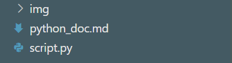

# Python環境構築
## 目次
1. Pythonのインストール
2. 環境構築の確認・Pythonの実行
3. Hello, world!の確認

※Visual Studio Codeが必要となりますので、まだインストールされていない方は下記のURLよりインストールしてください。

https://code.visualstudio.com/download

### 1 Pythonのインストール
 https://www.python.org/downloads/

上記のURLからPythonの公式ページでダウンロードしてください。

Python 3.9.7(2021/09/12現在)のボタンをクリックしexeファイルを実行しセットアップを開始してください。

上記の画面が出てきたら、「install launcher for all users」のチェックを外し

「ADD Python 3.9 to PATH」にチェックを入れ「Install Now」をクリックしてください。

インストールが完了しましたら。一度パソコンを再起動します。

### 環境構築の確認

Visual Studio Code を起動します。 

サイドバーにあるエクスプローラーをクリック(Ctrl+Shift+E)しファイル作成ボタンを押してください。

script.pyのファイルを作成していきましょう。

ファイルが作成できましたらprint文を作成してきます。

コードが書けましたらいよいよ実行scriptを実行していきます。

Ctrl + @ でターミナルを起動してください。

ターミナルが起動できましたら、「**python script.py**」をターミナルに入力し「**Enter**」を押してください。

上記の様に「Hello World」 を確認出来ればPythonの環境構築が完了です。

 